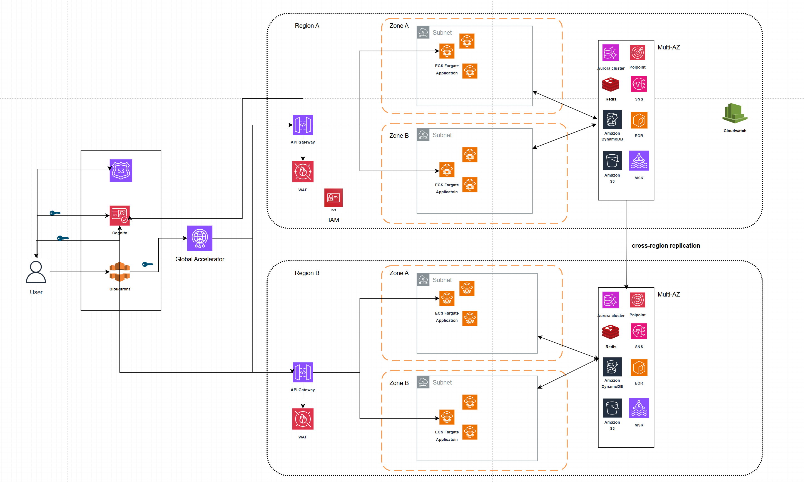

Tranding platform architecture.

1. Overview

    This architecture for a trading platform designed for high availability, scalability, disaster resilience, security and cost efficiency. It follows an active-active multi-region model to ensure low latency, fault tolerance, and seamless failover. Compute resources are deployed using serverless and auto-scaling solutions (e.g., AWS Fargate) to support dynamic workloads while optimizing costs.
    

2. Table of services

    | **Service**            | **Role in Architecture**                                      | **AWS Alternative**                                         |
    |------------------------|--------------------------------------------------------------|-------------------------------------------------------------|
    | **Route 53**          | DNS routing and failover management                          | Global Accelerator |
    | **CloudFront**        | CDN for caching and accelerating content delivery            | Global Accelerator (for traffic routing)                   |
    | **Cognito**           | User authentication and identity management                  | AWS IAM Federation, Amazon Verified Permissions           |
    | **AWS WAF**           | Web Application Firewall for API security                    | Shield Advanced (for DDoS protection)                      |
    | **API Gateway**       | Managed API service to handle client requests                | Application Load Balancer (ALB)              |
    | **IAM**              | Access management and authorization                          |                                  |
    | **ECS Fargate**       | Serverless container orchestration for trading applications  | AWS Lambda, Amazon EKS (Kubernetes)    |
    | **Aurora Cluster**    | Relational database with DynamoDB for transaction storage                   | Amazon RDS (MySQL/PostgreSQL), Amazon Redshift            |
    | **DynamoDB**         | NoSQL database for storing real-time trade data              | Amazon ElastiCache (for caching), Amazon Keyspaces (for Cassandra) |
    | **Amazon MSK (Kafka)** | Event streaming for trade execution and real-time updates   | Amazon Kinesis Data Streams, Amazon SQS                    |
    | **Redis (ElastiCache)** | In-memory caching to reduce DB load and improve latency      | DynamoDB DAX, Amazon MemoryDB for Redis                   |
    | **SNS (Simple Notification Service)** | Messaging service for event-driven architecture | Amazon EventBridge, Amazon SQS                              |
    | **ECR (Elastic Container Registry)** | Container image storage for ECS workloads      | Amazon S3 (for Docker images)           |
    | **Amazon S3**        | Object storage for logs, backups, and static content        | Amazon EFS (for file storage)                 |
    | **CloudWatch**       | Monitoring, logging, and alerting                            | AWS X-Ray (for tracing), AWS CloudTrail (for auditing)     |

3. Key feaures and how to achieve them.
    ## a. High Availability & Resiliency  
    - **CloudFront + Route 53** ensure low-latency access and intelligent traffic routing.  
    - **Global Accelerator** provides automatic failover and high availability.  
    - **Active-active multi-region deployment** with real-time data replication across regions.  
    - **Multi-AZ deployment** improves availability and fault tolerance.  

    ## b. Scalability  
    - **ECS Fargate, API Gateway, Aurora Cluster, and DynamoDB** use **on-demand auto-scaling** to handle varying workloads.  

    ## c. Security  
    - **Amazon Cognito** handles secure user authentication.  
    - **AWS WAF** protects against common attacks (SQL injection, DDoS, etc.).  

    ## d. Low Latency  
    - **CloudFront** caches static content at edge locations for faster access.  
    - **Global Accelerator** routes traffic over the AWS backbone to the nearest region, reducing latency.  

    ## e. Cost-Effectiveness  
    - **Leverage serverless services** to reduce operational overhead.  
    - **Use Spot Instances** for non-critical workloads to optimize costs.  
    - **Optimize storage** by using tiered storage solutions like **S3 Intelligent-Tiering**.  

    ## f. Observability.
    - **Monitoring & Metrics**: Use Amazon CloudWatch to collect and analyze metrics from ECS Fargate, API Gateway, ALB, and databases..
    - **Alerting**: Leverage Amazon SNS and CloudWatch Alarms trigger incident alert in real-time.

    
